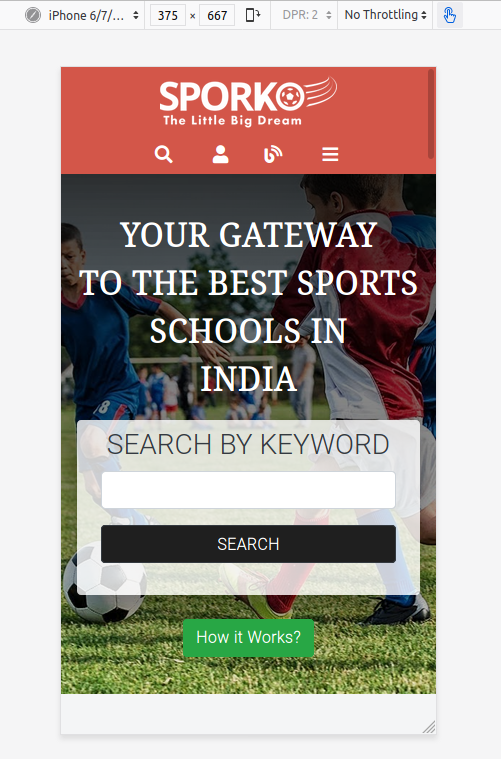

## Building a Responsive Sports Schools Directory using HTML & CSS

    A directory of sports schools is built loosely based on the design available. Focus on markup and styling. The purpose of this project is to master HTML & CSS.

    Break Points:

    Mobile Site - Minimum Width - 375px
    Tablet Site - Minimum Width - 768px
    Desktop Site - Minimum Width - 1024px
    Large Screen Desktops - Minimum Width - 1280px

    Typography:

    Fonts Used - Roboto, Droid Serif
    Font Family : Serif

    Primary Colors:

    #f4f5f6 - Body,
    #040444 - Header and Footer,
    #fff - Content Blocks,
    #000 - Text
    #000,#6c757d,#28a745 - Buttons

    Reference Design:

    https://www.behance.net/gallery/25563385/PatashuleKE

 

 

 

 

## Built With

- Html,
- CSS(Vanilla+Bootstrap),
- Linter,
- VS Code

## Live Demo

[Live Demo Link](https://raw.githack.com/akshay-narkar/Directory-Capstone-Project/development/index.html)

## Automated Test

> There are no automated tests for this project yet.

## Authors

👤 **Author1**

- Github: [@akshay-narkar]
- Twitter: [@akidoit]

## 🤝 Contributing

Contributions, issues and feature requests are welcome! Start by:

- Forking the project
- Cloning the project to your local machine
- `cd` into the project directory
- Run `git checkout -b your-branch-name`
- Make your contributions
- Push your branch up to your forked repository
- Open a Pull Request with a detailed description to the development branch of the original project for a review

## Show your support

Give a :star: if you like this project!

## 📝 License

This project is [MIT](https://opensource.org/licenses/MIT) licensed.
